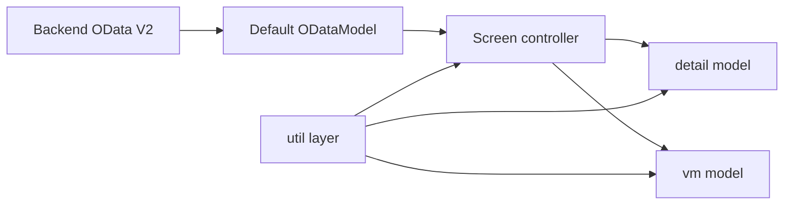

# KT Manuale Progetto - `apptracciabilita`

Manuale tecnico-operativo completo per handover, onboarding e manutenzione del progetto.

Obiettivo del documento:
- spiegare il progetto a chi non lo conosce
- mettere un developer junior nelle condizioni di lavorarci senza dipendere dalla memoria di chi lo ha sviluppato
- chiarire dove sta la logica, dove sono i punti delicati e come si modifica il codice senza introdurre regression

Stato del documento:
- aggiornato allo stato corrente del repository al `2026-04-27`
- coerente con la safety net oggi disponibile

---

## 1. Come leggere questo manuale

Se sei nuovo del progetto, non leggere tutto in ordine sparso. Segui questo percorso:

1. leggi `Scopo del progetto`
2. leggi `Quick start per un nuovo developer`
3. leggi `Modello mentale del progetto`
4. leggi `Routing e schermate`
5. leggi `Flow A / Flow B / Flow C`
6. leggi `Safety net e certificazione`
7. solo dopo entra nei capitoli `Util map`, `Invarianti`, `Ricette di modifica`

Se invece devi fare KT a Deloitte o a un altro team:

1. usa questo file come guida principale
2. usa [SMOKE_BACKEND_RUOLI.md](/Users/gabrielemurgia/Desktop/progettoVALENTINO/apptracciabilit-/SMOKE_BACKEND_RUOLI.md) come checklist di collaudo reale
3. usa [SMOKE_BACKEND_RUOLI_REPORT_TEMPLATE.md](/Users/gabrielemurgia/Desktop/progettoVALENTINO/apptracciabilit-/SMOKE_BACKEND_RUOLI_REPORT_TEMPLATE.md) per registrare l'esito

---

## 2. Scopo del progetto

`apptracciabilita` e` una applicazione SAPUI5/Fiori per la gestione della tracciabilita materiali.

L'app copre tre macro-flussi:

1. `Flow A`
   - consultazione e manutenzione dei record di tracciabilita
   - navigazione da liste aggregate al dettaglio
2. `Flow B`
   - caricamento massivo da Excel
   - CHECK backend
   - invio delle righe valide
3. `Flow C`
   - consultazione tabellare dei dati gia` salvati

Backend di riferimento:

- servizio OData V2: `/sap/opu/odata/sap/ZVEND_TRACE_SRV/`

---

## 3. Quick Start per un nuovo developer

### Requisiti locali

- Node.js
- npm
- dipendenze installate con `npm install`
- accesso al backend DEV quando serve collaudo reale

### Comandi principali

```bash
npm run build
npm run unit-test:headless
npm run integration-test:headless
```

Questi tre comandi sono il gate minimo prima di dichiarare "verde" una modifica.

### Avvio applicazione

```bash
npm run start-local
```

Usa [ui5-local.yaml](/Users/gabrielemurgia/Desktop/progettoVALENTINO/apptracciabilit-/ui5-local.yaml) con proxy backend e app reload.

### File da aprire per primi

In quest'ordine:

1. [webapp/manifest.json](/Users/gabrielemurgia/Desktop/progettoVALENTINO/apptracciabilit-/webapp/manifest.json)
2. [webapp/Component.js](/Users/gabrielemurgia/Desktop/progettoVALENTINO/apptracciabilit-/webapp/Component.js)
3. [webapp/controller/BaseController.js](/Users/gabrielemurgia/Desktop/progettoVALENTINO/apptracciabilit-/webapp/controller/BaseController.js)
4. [webapp/controller/Screen0.controller.js](/Users/gabrielemurgia/Desktop/progettoVALENTINO/apptracciabilit-/webapp/controller/Screen0.controller.js)
5. [webapp/controller/Screen2.controller.js](/Users/gabrielemurgia/Desktop/progettoVALENTINO/apptracciabilit-/webapp/controller/Screen2.controller.js)
6. [webapp/controller/Screen3.controller.js](/Users/gabrielemurgia/Desktop/progettoVALENTINO/apptracciabilit-/webapp/controller/Screen3.controller.js)
7. [webapp/controller/Screen4.controller.js](/Users/gabrielemurgia/Desktop/progettoVALENTINO/apptracciabilit-/webapp/controller/Screen4.controller.js)
8. [webapp/util/](/Users/gabrielemurgia/Desktop/progettoVALENTINO/apptracciabilit-/webapp/util)

### Regola fondamentale

La logica importante oggi vive soprattutto nei `util`, non nei controller.

Se devi cambiare un comportamento:
- prima cerca in `webapp/util/`
- solo se non trovi nulla, entra nel controller

---

## 4. Stack e tool

### Frontend

- SAPUI5 `1.108.31`
- XML Views
- JavaScript puro
- OData V2 model come model di default
- JSONModel per stato UI e cache applicativa

### Dipendenze principali

- `xlsx`
- `@ui5/cli`
- `@sap/ux-ui5-tooling`
- `mbt`

### Script npm importanti

- `npm run start-local`
- `npm run build`
- `npm run unit-test:headless`
- `npm run integration-test:headless`
- `npm run build:cf`
- `npm run build:mta`

### Nota importante su XLSX

La libreria [webapp/thirdparty/xlsx.full.min.js](/Users/gabrielemurgia/Desktop/progettoVALENTINO/apptracciabilit-/webapp/thirdparty/xlsx.full.min.js):
- viene caricata da `Screen6` a runtime
- e` stata esclusa dal component preload in [ui5.yaml](/Users/gabrielemurgia/Desktop/progettoVALENTINO/apptracciabilit-/ui5.yaml) e [ui5-deploy.yaml](/Users/gabrielemurgia/Desktop/progettoVALENTINO/apptracciabilit-/ui5-deploy.yaml)

Questo e` intenzionale. Non reintrodurre il file nel preload senza una ragione forte, altrimenti torna il warning di build.

---

## 5. Struttura del repository

### Root

- [package.json](/Users/gabrielemurgia/Desktop/progettoVALENTINO/apptracciabilit-/package.json)
  - script e dipendenze
- [ui5.yaml](/Users/gabrielemurgia/Desktop/progettoVALENTINO/apptracciabilit-/ui5.yaml)
  - config build/run principale
- [ui5-local.yaml](/Users/gabrielemurgia/Desktop/progettoVALENTINO/apptracciabilit-/ui5-local.yaml)
  - sviluppo locale con proxy backend
- [ui5-test.yaml](/Users/gabrielemurgia/Desktop/progettoVALENTINO/apptracciabilit-/ui5-test.yaml)
  - config minimale per runner headless
- [run-unit-headless.cjs](/Users/gabrielemurgia/Desktop/progettoVALENTINO/apptracciabilit-/run-unit-headless.cjs)
  - runner unit headless robusto
- [run-integration-headless.cjs](/Users/gabrielemurgia/Desktop/progettoVALENTINO/apptracciabilit-/run-integration-headless.cjs)
  - runner OPA headless robusto
- [run-qunit.cjs](/Users/gabrielemurgia/Desktop/progettoVALENTINO/apptracciabilit-/run-qunit.cjs)
  - runner QUnit browser
- [SMOKE_BACKEND_RUOLI.md](/Users/gabrielemurgia/Desktop/progettoVALENTINO/apptracciabilit-/SMOKE_BACKEND_RUOLI.md)
  - smoke test reali
- [SMOKE_BACKEND_RUOLI_REPORT_TEMPLATE.md](/Users/gabrielemurgia/Desktop/progettoVALENTINO/apptracciabilit-/SMOKE_BACKEND_RUOLI_REPORT_TEMPLATE.md)
  - template report smoke

### `webapp/`

- [Component.js](/Users/gabrielemurgia/Desktop/progettoVALENTINO/apptracciabilit-/webapp/Component.js)
  - bootstrap app
- [manifest.json](/Users/gabrielemurgia/Desktop/progettoVALENTINO/apptracciabilit-/webapp/manifest.json)
  - routing, modelli, data source
- [controller/](/Users/gabrielemurgia/Desktop/progettoVALENTINO/apptracciabilit-/webapp/controller)
  - orchestrazione UI per schermata
- [util/](/Users/gabrielemurgia/Desktop/progettoVALENTINO/apptracciabilit-/webapp/util)
  - logica business e tecnica
- [view/](/Users/gabrielemurgia/Desktop/progettoVALENTINO/apptracciabilit-/webapp/view)
  - XML view
- [i18n/](/Users/gabrielemurgia/Desktop/progettoVALENTINO/apptracciabilit-/webapp/i18n)
  - testi UI
- [test/](/Users/gabrielemurgia/Desktop/progettoVALENTINO/apptracciabilit-/webapp/test)
  - suite unit e integration

---

## 6. Modello mentale del progetto

Per capire davvero l'app bisogna separare quattro livelli:

1. `OData model`
   - model di default
   - parla con il backend reale
2. `vm` model
   - stato condiviso dell'app
   - cache cross-screen
   - domini
   - MMCT
   - ruolo utente
3. `detail` model di ogni schermata
   - stato locale della pagina
4. `util`
   - funzioni che fanno il vero lavoro

Mermaid ad alto livello:



Regola pratica:

- se qualcosa riguarda dati remoti -> guarda OData + util di load/save
- se qualcosa riguarda stato condiviso -> guarda `vm`
- se qualcosa riguarda una tabella o una singola schermata -> guarda `detail`

---

## 7. Bootstrap applicazione

File chiave: [webapp/Component.js](/Users/gabrielemurgia/Desktop/progettoVALENTINO/apptracciabilit-/webapp/Component.js)

### Cosa succede all'avvio

1. `UIComponent.prototype.init`
2. il model `i18n` viene messo anche sul `Core`
3. se i test OPA hanno iniettato un backend finto, il model OData viene sostituito
4. viene valorizzato il footer legale dinamico
5. viene inizializzato il router
6. viene messo il `device model`
7. sul `vm` vengono scritti:
   - `legalYear`
   - `logoSrc`

### Hook test-only

In `Component.js` c'e` un hook importante:

- `window.__vendTraceIntegrationBackend`

Serve ai test integration per iniettare un backend stateful senza inquinare il runtime normale.

Questo e` corretto e voluto. Non rimuoverlo senza aggiornare tutta la suite OPA.

---

## 8. Routing e schermate

Definito in [webapp/manifest.json](/Users/gabrielemurgia/Desktop/progettoVALENTINO/apptracciabilit-/webapp/manifest.json).

| Route | Pattern | Schermata | Scopo |
| --- | --- | --- | --- |
| `Screen0` | `` | Home | selezione flusso |
| `Screen1` | `vendors/{mode}` | Fornitori | lista vendor |
| `Screen2` | `materials/{vendorId}/{mode}` | Materiali | lista materiali |
| `Screen3` | `Screen3/{vendorId}/{material}/{season}` | Aggregato tracciabilita | parent rows |
| `Screen4` | `detail/{vendorId}/{material}/{recordKey}/{mode}` | Dettaglio | fibre/detail rows |
| `Screen5` | `dati-tabella` | Aggregato read-only | consultazione |
| `Screen6` | `caricamento-excel` | Excel | upload/check/send |

### Nota delicata su `Screen3`

La route di `Screen3` usa `season` nel path.

Questa parte e` storicamente sensibile perche':
- `Screen3` usa vendor/material/season per caricare e cachare
- `Screen4` torna indietro a `Screen3`
- dopo save backend ci sono flag transitori nel `vm`

Quindi:
- non cambiare questa route con leggerezza
- se la tocchi, devi rilanciare la safety net e fare smoke reale sul back-and-forth `Screen3 <-> Screen4`

---

## 9. Ruoli applicativi

Il ruolo viene dal backend, tipicamente da `UserInfosSet.UserType`.

Mapping usato nel frontend:

- `E` = fornitore
- `I` = utente interno Valentino
- `S` = superuser

### Matrice pratica

| Capacita` | E | I | S |
| --- | --- | --- | --- |
| vedere Flow A | si | si | si |
| vedere Flow B | si | si | si |
| vedere Flow C / `Screen5` | no | si | si |
| approve / reject | no | si | si |
| add row dove consentito | si | dipende | si |
| copy/delete avanzato | limitato | limitato | si |

### Nota importante sui permessi

I permessi non sono sparsi in modo casuale.

Il centro della logica e`:

- [webapp/util/statusUtil.js](/Users/gabrielemurgia/Desktop/progettoVALENTINO/apptracciabilit-/webapp/util/statusUtil.js)

Ma i flag finali di schermata vengono poi scritti nei model da:

- [webapp/util/screen3BindingUtil.js](/Users/gabrielemurgia/Desktop/progettoVALENTINO/apptracciabilit-/webapp/util/screen3BindingUtil.js)
- [webapp/util/screen4DetailUtil.js](/Users/gabrielemurgia/Desktop/progettoVALENTINO/apptracciabilit-/webapp/util/screen4DetailUtil.js)

### Regola di business da NON rompere

Il superuser puo` avere add/copy/delete piu` ampi, ma:

- il veto `record AP non eliminabile` deve restare

Questa regola e` protetta dai test.

---

## 10. I modelli: `vm`, `detail`, `ui`

### 10.1 OData model di default

E` configurato nel manifest e punta a:

- `/sap/opu/odata/sap/ZVEND_TRACE_SRV/`

E` il model di default `""`.

### 10.2 `vm` model

E` il model centrale dell'app.

Dentro ci sono:

- ruolo utente
- vendors
- categorie
- domini backend
- MMCT per categoria
- cache dati cross-screen
- flag transitori di navigazione

Campi concettualmente importanti:

- `/userType`
- `/userId`
- `/userVendors`
- `/userCategoriesList`
- `/domainsByName`
- `/mmctFieldsByCat`
- `/cache/dataRowsByKey`
- `/cache/recordsByKey`

### 10.3 `detail` model

Ogni schermata ha il proprio `detail` model locale.

Esempi:

- `Screen3`
  - `RecordsAll`
  - `Records`
  - `Header3Fields`
- `Screen4`
  - `RowsAll`
  - `Rows`
  - `Header4Fields`
- `Screen6`
  - `RowsAll`
  - `checkDone`
  - `checkErrorCount`

### 10.4 `ui` model

Usato per stato di presentazione, soprattutto:

- toggle header filters
- toggle header sort

---

## 11. `vmModelPaths`: perche' esiste

File: [webapp/util/vmModelPaths.js](/Users/gabrielemurgia/Desktop/progettoVALENTINO/apptracciabilit-/webapp/util/vmModelPaths.js)

Serve a centralizzare i path del `vm` model che prima erano stringhe duplicate.

Questo evita:
- typo
- path raw inconsistenti
- bug su cache e flag transitori

Se devi aggiungere un nuovo path condiviso:

1. definiscilo qui
2. usalo tramite helper, non come stringa raw sparsa

---

## 12. Flow A - Tracciabilita` UI

### 12.1 Variante per ruolo

#### Interni / superuser

`Screen0 -> Screen1 -> Screen2 -> Screen3 -> Screen4`

#### Fornitore

`Screen0 -> Screen2 -> Screen3 -> Screen4`

### 12.2 `Screen0`

File:

- [webapp/controller/Screen0.controller.js](/Users/gabrielemurgia/Desktop/progettoVALENTINO/apptracciabilit-/webapp/controller/Screen0.controller.js)
- [webapp/view/Screen0.view.xml](/Users/gabrielemurgia/Desktop/progettoVALENTINO/apptracciabilit-/webapp/view/Screen0.view.xml)

Responsabilita`:

- bootstrap iniziale del `vm`
- lettura `UserInfosSet`
- costruzione auth / domini / MMCT / categorie
- gestione backend down
- navigazione ai flussi

Entity set coinvolti:

- `UserInfosSet`
- `VendorDataSet`

### 12.3 `Screen1`

File:

- [webapp/controller/Screen1.controller.js](/Users/gabrielemurgia/Desktop/progettoVALENTINO/apptracciabilit-/webapp/controller/Screen1.controller.js)
- [webapp/view/Screen1.view.xml](/Users/gabrielemurgia/Desktop/progettoVALENTINO/apptracciabilit-/webapp/view/Screen1.view.xml)

Scopo:

- mostrare i fornitori disponibili
- filtrare per categoria e testo
- selezionare vendor e andare a `Screen2`

Entity set principale:

- `VendorDataSet`

### 12.4 `Screen2`

File:

- [webapp/controller/Screen2.controller.js](/Users/gabrielemurgia/Desktop/progettoVALENTINO/apptracciabilit-/webapp/controller/Screen2.controller.js)
- [webapp/util/screen2FlowUtil.js](/Users/gabrielemurgia/Desktop/progettoVALENTINO/apptracciabilit-/webapp/util/screen2FlowUtil.js)
- [webapp/view/Screen2.view.xml](/Users/gabrielemurgia/Desktop/progettoVALENTINO/apptracciabilit-/webapp/view/Screen2.view.xml)

Scopo:

- mostrare i materiali del vendor
- filtrare per categoria, stagione, materiale, testo
- supportare `LOCK / RELEASE`
- entrare in `Screen3`

Entity set principali:

- `MaterialDataSet`
- `MaterialStatusSet`
- `MassMaterialStatusSet`

### 12.5 `Screen3`

File:

- [webapp/controller/Screen3.controller.js](/Users/gabrielemurgia/Desktop/progettoVALENTINO/apptracciabilit-/webapp/controller/Screen3.controller.js)
- [webapp/util/screen3ControllerFlowUtil.js](/Users/gabrielemurgia/Desktop/progettoVALENTINO/apptracciabilit-/webapp/util/screen3ControllerFlowUtil.js)
- [webapp/util/screen3BindingUtil.js](/Users/gabrielemurgia/Desktop/progettoVALENTINO/apptracciabilit-/webapp/util/screen3BindingUtil.js)
- [webapp/util/screen3CrudUtil.js](/Users/gabrielemurgia/Desktop/progettoVALENTINO/apptracciabilit-/webapp/util/screen3CrudUtil.js)
- [webapp/util/screen3SaveUtil.js](/Users/gabrielemurgia/Desktop/progettoVALENTINO/apptracciabilit-/webapp/util/screen3SaveUtil.js)
- [webapp/view/Screen3.view.xml](/Users/gabrielemurgia/Desktop/progettoVALENTINO/apptracciabilit-/webapp/view/Screen3.view.xml)

Scopo:

- mostrare i record parent aggregati
- applicare filtri stato/testuali/header
- aggiungere/copiare/eliminare parent row
- salvare al backend
- navigare al dettaglio `Screen4`

Concetti chiave:

- `RecordsAll` = dataset completo
- `Records` = dataset filtrato
- snapshot locale per dirty/back
- cache nel `vm`
- supporto `NoMatList`

### 12.6 `Screen4`

File:

- [webapp/controller/Screen4.controller.js](/Users/gabrielemurgia/Desktop/progettoVALENTINO/apptracciabilit-/webapp/controller/Screen4.controller.js)
- [webapp/util/screen4ControllerFlowUtil.js](/Users/gabrielemurgia/Desktop/progettoVALENTINO/apptracciabilit-/webapp/util/screen4ControllerFlowUtil.js)
- [webapp/util/screen4DetailUtil.js](/Users/gabrielemurgia/Desktop/progettoVALENTINO/apptracciabilit-/webapp/util/screen4DetailUtil.js)
- [webapp/util/screen4RowsUtil.js](/Users/gabrielemurgia/Desktop/progettoVALENTINO/apptracciabilit-/webapp/util/screen4RowsUtil.js)
- [webapp/util/screen4SaveUtil.js](/Users/gabrielemurgia/Desktop/progettoVALENTINO/apptracciabilit-/webapp/util/screen4SaveUtil.js)
- [webapp/util/screen4AttachUtil.js](/Users/gabrielemurgia/Desktop/progettoVALENTINO/apptracciabilit-/webapp/util/screen4AttachUtil.js)
- [webapp/util/screen4FilterUtil.js](/Users/gabrielemurgia/Desktop/progettoVALENTINO/apptracciabilit-/webapp/util/screen4FilterUtil.js)
- [webapp/view/Screen4.view.xml](/Users/gabrielemurgia/Desktop/progettoVALENTINO/apptracciabilit-/webapp/view/Screen4.view.xml)

Scopo:

- mostrare le righe dettaglio fibre del parent selezionato
- permettere editing locale
- gestire attachment
- add/copy/delete row
- save locale
- save backend

Concetti chiave:

- `RowsAll` = tutte le detail rows
- `Rows` = vista filtrata
- attachment a livello di campo
- polling per sync contatori attachment
- save backend che resta su `Screen4`

### 12.7 Invarianti critici di Flow A

Queste regole vanno conosciute prima di toccare il codice:

1. `Screen4` save backend deve restare su `Screen4`
2. tornando a `Screen3` dopo save, la cache deve essere fresca
3. `Screen3 copy` non deve duplicare business key non salvabili
4. `Screen4 copy` deve azzerare i campi sensibili previsti
5. il superuser puo` avere permessi piu` larghi, ma non deve eliminare record `AP`
6. `NoMatList` e` un ramo speciale e non va assimilato al flusso materiale normale

---

## 13. Flow B - Excel (`Screen6`)

File:

- [webapp/controller/Screen6.controller.js](/Users/gabrielemurgia/Desktop/progettoVALENTINO/apptracciabilit-/webapp/controller/Screen6.controller.js)
- [webapp/util/screen6FlowUtil.js](/Users/gabrielemurgia/Desktop/progettoVALENTINO/apptracciabilit-/webapp/util/screen6FlowUtil.js)
- [webapp/util/s6ExcelUtil.js](/Users/gabrielemurgia/Desktop/progettoVALENTINO/apptracciabilit-/webapp/util/s6ExcelUtil.js)
- [webapp/view/Screen6.view.xml](/Users/gabrielemurgia/Desktop/progettoVALENTINO/apptracciabilit-/webapp/view/Screen6.view.xml)

Passi del flusso:

1. scelta categoria materiale
2. download template
3. download material list
4. upload file
5. parsing XLSX
6. mapping colonne Excel -> MMCT
7. validazione required
8. CHECK backend
9. preview tabellare
10. SEND righe valide

Entity set coinvolti:

- `GetFieldFileSet`
- `ExcelMaterialListSet`
- `CheckDataSet`
- `PostDataSet`

### Nota tecnica importante

`Screen6` carica `xlsx.full.min.js` dinamicamente:

- prima dalla risorsa locale del progetto
- poi da CDN solo come fallback

Questo e` intenzionale.

---

## 14. Flow C - Dati in tabella (`Screen5`)

File:

- [webapp/controller/Screen5.controller.js](/Users/gabrielemurgia/Desktop/progettoVALENTINO/apptracciabilit-/webapp/controller/Screen5.controller.js)
- [webapp/util/screen5FlowUtil.js](/Users/gabrielemurgia/Desktop/progettoVALENTINO/apptracciabilit-/webapp/util/screen5FlowUtil.js)
- [webapp/view/Screen5.view.xml](/Users/gabrielemurgia/Desktop/progettoVALENTINO/apptracciabilit-/webapp/view/Screen5.view.xml)

Scopo:

- consultazione read-only dei dati salvati
- filtro per categoria
- filtro globale, filtri stato, sort
- export

Entity set principale:

- `DataSet` con filtro `OnlySaved`

---

## 15. Mappa dei servizi OData

I punti principali usati dal frontend sono:

| Endpoint | Uso |
| --- | --- |
| `UserInfosSet` | bootstrap utente, ruolo, domini, MMCT |
| `VendorDataSet` | lista fornitori |
| `MaterialDataSet` | lista materiali |
| `DataSet` | record tracciabilita / dettaglio / consultazione |
| `VendorBatchSet` | supporto save/lookup vendor batch |
| `MaterialStatusSet` | lock/release singolo |
| `MassMaterialStatusSet` | lock/release massivo |
| `PostDataSet` | save backend Screen3/Screen4 e SEND Screen6 |
| `CheckDataSet` | CHECK Screen6 |
| `ExcelMaterialListSet` | lista materiali per export in Screen6 |
| `GetFieldFileSet` | template Excel, logo, download field-based |
| `AttachmentSet` | upload attachment |
| `zget_attachment_list` | lista attachment |

Se aggiungi un endpoint nuovo:

1. cerca se esiste gia` un util affine
2. evita di mettere `oModel.read/create` direttamente nel controller se non e` strettamente necessario
3. aggiungi test dove possibile

---

## 16. Mappa dei `util`

Questa e` la parte piu` importante da capire per manutenzione.

### Util base / trasversali

- [normalize.js](/Users/gabrielemurgia/Desktop/progettoVALENTINO/apptracciabilit-/webapp/util/normalize.js)
  - normalizzazioni di base
- [i18nUtil.js](/Users/gabrielemurgia/Desktop/progettoVALENTINO/apptracciabilit-/webapp/util/i18nUtil.js)
  - accesso robusto alle chiavi i18n
- [domains.js](/Users/gabrielemurgia/Desktop/progettoVALENTINO/apptracciabilit-/webapp/util/domains.js)
  - domini e lookup testo/valore
- [vmModelPaths.js](/Users/gabrielemurgia/Desktop/progettoVALENTINO/apptracciabilit-/webapp/util/vmModelPaths.js)
  - path centralizzati del `vm`
- [screenFlowStateUtil.js](/Users/gabrielemurgia/Desktop/progettoVALENTINO/apptracciabilit-/webapp/util/screenFlowStateUtil.js)
  - flag transitori tra schermate
- [statusUtil.js](/Users/gabrielemurgia/Desktop/progettoVALENTINO/apptracciabilit-/webapp/util/statusUtil.js)
  - permessi, stato, regole per ruolo

### Tabella / filter / sort / MDC

- [mdcTableUtil.js](/Users/gabrielemurgia/Desktop/progettoVALENTINO/apptracciabilit-/webapp/util/mdcTableUtil.js)
- [filterSortUtil.js](/Users/gabrielemurgia/Desktop/progettoVALENTINO/apptracciabilit-/webapp/util/filterSortUtil.js)
- [p13nUtil.js](/Users/gabrielemurgia/Desktop/progettoVALENTINO/apptracciabilit-/webapp/util/p13nUtil.js)
- [TableColumnAutoSize.js](/Users/gabrielemurgia/Desktop/progettoVALENTINO/apptracciabilit-/webapp/util/TableColumnAutoSize.js)

### Cell templates / dirty / error styling

- [cellTemplateUtil.js](/Users/gabrielemurgia/Desktop/progettoVALENTINO/apptracciabilit-/webapp/util/cellTemplateUtil.js)
- [dirtyHookUtil.js](/Users/gabrielemurgia/Desktop/progettoVALENTINO/apptracciabilit-/webapp/util/dirtyHookUtil.js)
- [rowErrorUtil.js](/Users/gabrielemurgia/Desktop/progettoVALENTINO/apptracciabilit-/webapp/util/rowErrorUtil.js)
- [touchCodAggUtil.js](/Users/gabrielemurgia/Desktop/progettoVALENTINO/apptracciabilit-/webapp/util/touchCodAggUtil.js)

### Flow A - Screen3

- [screen3ControllerFlowUtil.js](/Users/gabrielemurgia/Desktop/progettoVALENTINO/apptracciabilit-/webapp/util/screen3ControllerFlowUtil.js)
  - lifecycle/load/selection glue
- [screen3BindingUtil.js](/Users/gabrielemurgia/Desktop/progettoVALENTINO/apptracciabilit-/webapp/util/screen3BindingUtil.js)
  - bind/hydrate/column config/snapshot
- [screen3CrudUtil.js](/Users/gabrielemurgia/Desktop/progettoVALENTINO/apptracciabilit-/webapp/util/screen3CrudUtil.js)
  - add/copy/delete/nav detail
- [screen3SaveUtil.js](/Users/gabrielemurgia/Desktop/progettoVALENTINO/apptracciabilit-/webapp/util/screen3SaveUtil.js)
  - save e gestione post-error

### Flow A - Screen4

- [screen4ControllerFlowUtil.js](/Users/gabrielemurgia/Desktop/progettoVALENTINO/apptracciabilit-/webapp/util/screen4ControllerFlowUtil.js)
  - lifecycle/load/detail glue
- [screen4DetailUtil.js](/Users/gabrielemurgia/Desktop/progettoVALENTINO/apptracciabilit-/webapp/util/screen4DetailUtil.js)
  - resolve selezione, MMCT, permessi, bind
- [screen4RowsUtil.js](/Users/gabrielemurgia/Desktop/progettoVALENTINO/apptracciabilit-/webapp/util/screen4RowsUtil.js)
  - add/copy/delete/detail dirty logic
- [screen4SaveUtil.js](/Users/gabrielemurgia/Desktop/progettoVALENTINO/apptracciabilit-/webapp/util/screen4SaveUtil.js)
  - save locale + backend
- [screen4AttachUtil.js](/Users/gabrielemurgia/Desktop/progettoVALENTINO/apptracciabilit-/webapp/util/screen4AttachUtil.js)
  - sync attachment counters e polling
- [screen4FilterUtil.js](/Users/gabrielemurgia/Desktop/progettoVALENTINO/apptracciabilit-/webapp/util/screen4FilterUtil.js)
  - filtri header custom di Screen4
- [screen4ExportUtil.js](/Users/gabrielemurgia/Desktop/progettoVALENTINO/apptracciabilit-/webapp/util/screen4ExportUtil.js)
  - print/export Screen4

### Flow B - Screen6

- [screen6FlowUtil.js](/Users/gabrielemurgia/Desktop/progettoVALENTINO/apptracciabilit-/webapp/util/screen6FlowUtil.js)
- [s6ExcelUtil.js](/Users/gabrielemurgia/Desktop/progettoVALENTINO/apptracciabilit-/webapp/util/s6ExcelUtil.js)

### Flow C - Screen5

- [screen5FlowUtil.js](/Users/gabrielemurgia/Desktop/progettoVALENTINO/apptracciabilit-/webapp/util/screen5FlowUtil.js)

### Attachment

- [attachmentUtil.js](/Users/gabrielemurgia/Desktop/progettoVALENTINO/apptracciabilit-/webapp/util/attachmentUtil.js)
- [attachmentCellTemplate.js](/Users/gabrielemurgia/Desktop/progettoVALENTINO/apptracciabilit-/webapp/util/attachmentCellTemplate.js)

### Save / load / cache

- [saveUtil.js](/Users/gabrielemurgia/Desktop/progettoVALENTINO/apptracciabilit-/webapp/util/saveUtil.js)
- [dataLoaderUtil.js](/Users/gabrielemurgia/Desktop/progettoVALENTINO/apptracciabilit-/webapp/util/dataLoaderUtil.js)
- [vmCache.js](/Users/gabrielemurgia/Desktop/progettoVALENTINO/apptracciabilit-/webapp/util/vmCache.js)
- [recordsUtil.js](/Users/gabrielemurgia/Desktop/progettoVALENTINO/apptracciabilit-/webapp/util/recordsUtil.js)

---

## 17. Regole e invarianti da non rompere

Questa sezione e` fondamentale.

### 17.1 Cache e snapshot

- `Screen3` e `Screen4` usano cache nel `vm`
- usano anche snapshot locali per dirty/back
- dopo un save backend non devono riusare snapshot stale

### 17.2 `NoMatList`

Se `NoMatList` e` attivo:
- `Screen3` entra in un ramo speciale
- add/copy/delete non vanno liberalizzati a caso
- i filtri cambiano semantica

### 17.3 Copy row

`Screen3` e `Screen4` non copiano semplicemente tutto.

Esistono campi che devono essere:
- svuotati
- rigenerati
- mantenuti

Per questo il copy va sempre toccato nei `util`, non via clone grezzo nel controller.

### 17.4 Save `Screen4`

Dopo save backend:
- l'utente resta su `Screen4`
- il dettaglio viene riallineato
- tornando a `Screen3`, la cache deve restare coerente

### 17.5 Permessi superuser

Il superuser puo` avere add/copy/delete piu` larghi, ma:
- non deve bypassare i veti di business espliciti
- in particolare il veto su record `AP` resta

### 17.6 Attachment counters

In `Screen4` gli attachment sono trattati a livello di campo condiviso:
- il contatore viene propagato alle altre righe
- esiste un polling controllato per farlo

---

## 18. Safety net e certificazione

## 18.1 Build e test automatici

Comandi principali:

```bash
npm run build
npm run unit-test:headless
npm run integration-test:headless
```

### Stato corrente della safety net

Al momento della stesura:

- unit test: `433/433`
- integration test: `7/7`

### Cosa copre la suite unit

File principali:

- [webapp/test/unit/util/statusUtil.qunit.js](/Users/gabrielemurgia/Desktop/progettoVALENTINO/apptracciabilit-/webapp/test/unit/util/statusUtil.qunit.js)
- [webapp/test/unit/util/vmModelPaths.qunit.js](/Users/gabrielemurgia/Desktop/progettoVALENTINO/apptracciabilit-/webapp/test/unit/util/vmModelPaths.qunit.js)
- [webapp/test/unit/util/screenFlowStateUtil.qunit.js](/Users/gabrielemurgia/Desktop/progettoVALENTINO/apptracciabilit-/webapp/test/unit/util/screenFlowStateUtil.qunit.js)
- [webapp/test/unit/util/screen3BindingUtil.qunit.js](/Users/gabrielemurgia/Desktop/progettoVALENTINO/apptracciabilit-/webapp/test/unit/util/screen3BindingUtil.qunit.js)
- [webapp/test/unit/util/screen3CrudUtil.qunit.js](/Users/gabrielemurgia/Desktop/progettoVALENTINO/apptracciabilit-/webapp/test/unit/util/screen3CrudUtil.qunit.js)
- [webapp/test/unit/util/screen3SaveUtil.qunit.js](/Users/gabrielemurgia/Desktop/progettoVALENTINO/apptracciabilit-/webapp/test/unit/util/screen3SaveUtil.qunit.js)
- [webapp/test/unit/util/screen4AttachUtil.qunit.js](/Users/gabrielemurgia/Desktop/progettoVALENTINO/apptracciabilit-/webapp/test/unit/util/screen4AttachUtil.qunit.js)
- [webapp/test/unit/util/screen4RowsUtil.qunit.js](/Users/gabrielemurgia/Desktop/progettoVALENTINO/apptracciabilit-/webapp/test/unit/util/screen4RowsUtil.qunit.js)
- [webapp/test/unit/util/screen4SaveUtil.qunit.js](/Users/gabrielemurgia/Desktop/progettoVALENTINO/apptracciabilit-/webapp/test/unit/util/screen4SaveUtil.qunit.js)
- [webapp/test/unit/util/screen4DetailUtil.qunit.js](/Users/gabrielemurgia/Desktop/progettoVALENTINO/apptracciabilit-/webapp/test/unit/util/screen4DetailUtil.qunit.js)
- [webapp/test/unit/util/screen6FlowUtil.qunit.js](/Users/gabrielemurgia/Desktop/progettoVALENTINO/apptracciabilit-/webapp/test/unit/util/screen6FlowUtil.qunit.js)
- [webapp/test/unit/util/s6ExcelUtil.qunit.js](/Users/gabrielemurgia/Desktop/progettoVALENTINO/apptracciabilit-/webapp/test/unit/util/s6ExcelUtil.qunit.js)
- [webapp/test/unit/controller/BaseController.qunit.js](/Users/gabrielemurgia/Desktop/progettoVALENTINO/apptracciabilit-/webapp/test/unit/controller/BaseController.qunit.js)

### Cosa copre la suite integration

Journey principali:

- [FlowAJourney.js](/Users/gabrielemurgia/Desktop/progettoVALENTINO/apptracciabilit-/webapp/test/integration/journeys/FlowAJourney.js)
- [FlowBJourney.js](/Users/gabrielemurgia/Desktop/progettoVALENTINO/apptracciabilit-/webapp/test/integration/journeys/FlowBJourney.js)
- [FlowCJourney.js](/Users/gabrielemurgia/Desktop/progettoVALENTINO/apptracciabilit-/webapp/test/integration/journeys/FlowCJourney.js)
- [RoleProfilesJourney.js](/Users/gabrielemurgia/Desktop/progettoVALENTINO/apptracciabilit-/webapp/test/integration/journeys/RoleProfilesJourney.js)

### Backend finto integration

File chiave:

- [IntegrationBackend.js](/Users/gabrielemurgia/Desktop/progettoVALENTINO/apptracciabilit-/webapp/test/integration/arrangements/IntegrationBackend.js)
- [IntegrationODataModel.js](/Users/gabrielemurgia/Desktop/progettoVALENTINO/apptracciabilit-/webapp/test/integration/arrangements/IntegrationODataModel.js)
- [BackendProfiles.js](/Users/gabrielemurgia/Desktop/progettoVALENTINO/apptracciabilit-/webapp/test/integration/fixtures/BackendProfiles.js)

Serve a simulare:
- ruolo `E` derivato da payload reali
- profili sintetici `I` e `S`
- flow A/B/C senza backend vero

## 18.2 Smoke reali

La suite automatica non sostituisce il backend reale.

Per il collaudo manuale usare sempre:

- [SMOKE_BACKEND_RUOLI.md](/Users/gabrielemurgia/Desktop/progettoVALENTINO/apptracciabilit-/SMOKE_BACKEND_RUOLI.md)
- [SMOKE_BACKEND_RUOLI_REPORT_TEMPLATE.md](/Users/gabrielemurgia/Desktop/progettoVALENTINO/apptracciabilit-/SMOKE_BACKEND_RUOLI_REPORT_TEMPLATE.md)

## 18.3 Nota sui runner headless

I runner [run-unit-headless.cjs](/Users/gabrielemurgia/Desktop/progettoVALENTINO/apptracciabilit-/run-unit-headless.cjs) e [run-integration-headless.cjs](/Users/gabrielemurgia/Desktop/progettoVALENTINO/apptracciabilit-/run-integration-headless.cjs):

- supportano sia `127.0.0.1` sia `::1`
- aspettano anche il rilascio della porta in teardown

Questo evita falsi rossi dovuti al bootstrap locale dei server test.

---

## 19. Come modificare il progetto senza romperlo

### Caso A - devi cambiare un permesso

Ordine corretto:

1. [statusUtil.js](/Users/gabrielemurgia/Desktop/progettoVALENTINO/apptracciabilit-/webapp/util/statusUtil.js)
2. `screen3BindingUtil` / `screen4DetailUtil`
3. test unit relativi
4. smoke ruolo reale

### Caso B - devi cambiare add/copy/delete

Ordine corretto:

1. `screen3CrudUtil` o `screen4RowsUtil`
2. se necessario `rowManagementUtil`
3. test unit mirati
4. Flow A integration
5. smoke reale su `Screen3/4`

### Caso C - devi cambiare save backend

Ordine corretto:

1. [saveUtil.js](/Users/gabrielemurgia/Desktop/progettoVALENTINO/apptracciabilit-/webapp/util/saveUtil.js)
2. `screen3SaveUtil` o `screen4SaveUtil`
3. test payload/buildSavePayload
4. test integration Flow A
5. smoke reale save/back/re-entry

### Caso D - devi aggiungere una colonna/campo UI

Controlla:

1. MMCT / metadata di configurazione
2. `screen3BindingUtil` o `screen4DetailUtil`
3. `cellTemplateUtil`
4. export
5. eventuale validazione save

### Caso E - devi toccare `Screen6`

Controlla sempre:

1. `screen6FlowUtil`
2. `s6ExcelUtil`
3. template XLSX
4. `CheckDataSet`
5. `PostDataSet`

### Regola d'oro

Se stai per mettere business logic in un controller, fermati e chiediti:

- esiste gia` un util giusto?
- il codice che sto scrivendo e` testabile fuori dal controller?

Se la risposta e` si, allora il controller non e` il posto giusto.

---

## 20. Troubleshooting

### Problema: save backend ok ma rientrando i dati non tornano

Aree da controllare:

- `screen4SaveUtil`
- `screenFlowStateUtil`
- cache `vm`
- snapshot `Screen3/Screen4`

### Problema: copy row poi save fallisce con business key duplicata

Aree da controllare:

- `screen3CrudUtil`
- `rowManagementUtil`
- `screen4RowsUtil`
- `screen4SaveUtil`
- `saveUtil`

### Problema: attachment count incoerente tra righe

Aree da controllare:

- `screen4AttachUtil`
- `attachmentUtil`
- `attachmentCellTemplate`

### Problema: filtri header non si vedono o non si resettano

Aree da controllare:

- `BaseController`
- `filterSortUtil`
- `mdcTableUtil`
- `screen4FilterUtil` per `Screen4`

### Problema: Excel non carica o build warning torna

Aree da controllare:

- `Screen6.controller`
- `screen6FlowUtil`
- `ui5.yaml`
- `ui5-deploy.yaml`

### Problema: un test integration fallisce ma i flow sembrano sani

Controlla:

- backend integration fake
- profilo ruolo in `BackendProfiles.js`
- fixture `Screen6`
- runner headless e porte locali

---

## 21. Debito tecnico residuo

Stato sintetico attuale:

- safety net forte
- controller `Screen3` e `Screen4` ridotti in modo importante
- catch silenziosi sostanzialmente bonificati
- warning `xlsx` sistemato
- smoke backend/ruoli consolidati come processo

Debito residuo principale:

- timer/workaround ancora presenti
- dipendenza da backend reale per chiudere smoke completi
- alcuni warning di framework/tooling esterni alla logica app
- `Screen2` ancora piu` grande del target ideale

Valutazione pratica attuale:

- debito tecnico: `medio-basso`, vicino a `basso`

---

## 22. Checklist finale per chi subentra

### Primo giorno

1. fai partire `npm run build`
2. fai partire `npm run unit-test:headless`
3. fai partire `npm run integration-test:headless`
4. apri `manifest.json`, `Component.js`, `BaseController.js`
5. leggi `Screen0`, `Screen2`, `Screen3`, `Screen4`, `Screen6`

### Prima modifica vera

1. individua il `util` corretto
2. aggiungi o aggiorna il test
3. esegui gate automatico
4. se tocca backend/ruolo, esegui smoke reale

### Cose da NON fare

1. non duplicare path raw del `vm`
2. non mettere business logic nuova in controller se puo` stare in util
3. non toccare route/cache/snapshot senza safety net e smoke
4. non reintrodurre fallback mock in runtime app
5. non cambiare copy/save di `Screen3/4` senza test dedicati

---

## 23. In quali file guardare per ogni problema

| Tema | File principali |
| --- | --- |
| bootstrap app | `Component.js`, `Screen0.controller.js` |
| routing | `manifest.json` |
| ruolo e permessi | `statusUtil.js`, `screen3BindingUtil.js`, `screen4DetailUtil.js` |
| cache shared state | `vmModelPaths.js`, `screenFlowStateUtil.js`, `vmCache.js` |
| Flow A save/copy/delete | `screen3CrudUtil.js`, `screen3SaveUtil.js`, `screen4RowsUtil.js`, `screen4SaveUtil.js` |
| Screen4 attachments | `screen4AttachUtil.js`, `attachmentUtil.js`, `attachmentCellTemplate.js` |
| Screen6 Excel | `screen6FlowUtil.js`, `s6ExcelUtil.js`, `Screen6.controller.js` |
| Flow C | `screen5FlowUtil.js`, `Screen5.controller.js` |
| filtri header | `BaseController.js`, `filterSortUtil.js`, `mdcTableUtil.js`, `screen4FilterUtil.js` |
| export | `exportUtil.js`, `screen4ExportUtil.js`, `screen5FlowUtil.js` |
| test unit | `webapp/test/unit/**` |
| test integration | `webapp/test/integration/**` |

---

## 24. Conclusione

Questo progetto non va piu` letto come "un insieme di controller grandi".

Il modello corretto oggi e`:

- i controller orchestrano
- i `util` fanno il lavoro
- il `vm` mantiene lo stato condiviso
- la safety net protegge i refactor

Se un nuovo developer capisce bene:

1. `manifest`
2. `Component`
3. `vm model`
4. `Screen2 -> Screen3 -> Screen4`
5. `screen6FlowUtil`
6. `statusUtil`

allora ha gia` in mano il cuore del progetto.

Per ogni modifica:

1. parti dal `util`
2. copri la modifica con test
3. esegui il gate automatico
4. chiudi con smoke reale se tocchi backend/ruoli

Questo e` il modo corretto di lavorare su `apptracciabilita` senza reintrodurre fragilita`.
