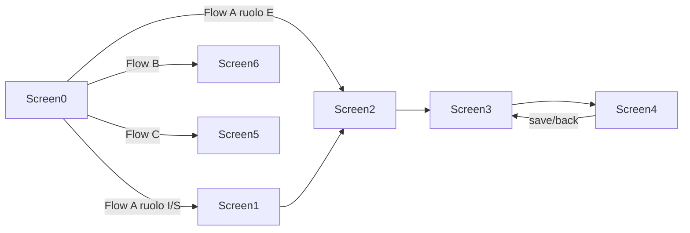
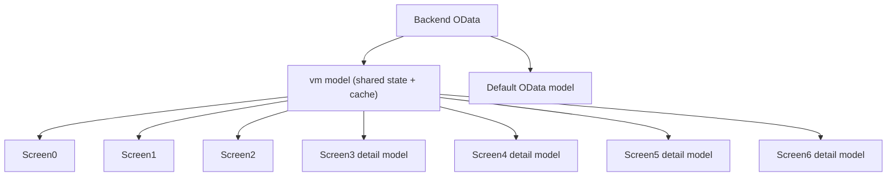

# Manuale KT - Progetto `apptracciabilita`

Documento di handover tecnico-operativo per permettere a un nuovo team di prendere in carico il progetto senza dipendere dalla conoscenza implicita di chi lo ha sviluppato.

Versione del manuale: stato del repository al `2026-04-26`.

## 1. Scopo del progetto

`apptracciabilita` e una applicazione SAPUI5/Fiori che gestisce la tracciabilita materiali lato fornitore e lato Valentino.

Il progetto copre tre macro-flussi:

1. Flusso A - consultazione e manutenzione tracciabilita tramite schermate aggregate e di dettaglio.
2. Flusso B - caricamento massivo da Excel con CHECK preliminare e invio finale.
3. Flusso C - consultazione in tabella dei dati gia salvati.

Il backend di riferimento e il servizio OData V2:

- `/sap/opu/odata/sap/ZVEND_TRACE_SRV/`

## 2. Stack, runtime e tool

### Frontend

- SAPUI5 `1.108.31`
- App Fiori "Basic V2"
- JavaScript puro, nessun TypeScript
- XML Views
- OData V2 model come modello di default
- JSONModel aggiuntivi per stato locale

### Dipendenze principali

- `xlsx` per gestione Excel
- `@ui5/cli`
- `@sap/ux-ui5-tooling`
- `mbt` per packaging MTA

### Comandi principali

- `npm start`
  - Avvia l'app nel preview FLP.
- `npm run start-local`
  - Avvio locale con proxy backend e appreload.
- `npm run unit-test:headless`
  - Safety net headless ripetibile.
- `npm run build`
  - Build UI5 locale in `dist/`.
- `npm run build:cf`
  - Build per deploy CF.
- `npm run build:mta`
  - Packaging MTA.

## 3. Struttura del repository

### Root

- `package.json`
  - Script npm e dipendenze.
- `ui5.yaml`
  - Config principale UI5.
- `ui5-local.yaml`
  - Config sviluppo locale con proxy backend.
- `ui5-test.yaml`
  - Config minimale per test headless.
- `run-qunit.cjs`
  - Runner QUnit via Puppeteer.
- `run-unit-headless.cjs`
  - Orchestratore server test + runner headless.
- `mta.yaml`
  - Packaging / deploy su BTP CF.
- `xs-app.json`
  - Route app router.

### `webapp/`

- `Component.js`
  - Bootstrap applicazione, router, model i18n sul Core, anno legale, logo dinamico.
- `manifest.json`
  - Routing, modelli, data source.
- `controller/`
  - Controller delle schermate.
- `util/`
  - Business logic, cache, save/post, rendering table, attachment, Excel, stato cross-screen.
- `view/`
  - XML View.
- `i18n/`
  - Resource bundle.
- `test/`
  - QUnit / OPA.
- `localService/`
  - Metadata locale.
- `thirdparty/`
  - Librerie terze statiche, tra cui `xlsx.full.min.js`.

## 4. Modello mentale del progetto

Il progetto va capito in quattro livelli:

1. `OData Model` di default
   - Backend reale, letture e POST.
2. `vm` model
   - Stato applicativo condiviso tra schermate.
   - Cache, domini, MMCT, ruolo utente, lista fornitori, stato cross-screen.
3. `detail` model di ogni schermata
   - Stato locale della schermata corrente.
4. Util layer
   - Quasi tutta la logica importante vive qui.

In pratica:

- il backend fornisce dati e metadata di business;
- il `vm` li rende riusabili tra schermate;
- il `detail` governa la singola pagina;
- i `util` fanno il vero lavoro su payload, cache, merge, status, filtri, attachment, Excel.

## 5. Ruoli applicativi

Il ruolo deriva da `UserInfosSet.UserType`.

Mapping attuale:

- `E` -> `FORNITORE`
- `I` -> `VALENTINO`
- `S` -> `SUPERUSER`

Effetti principali:

- `E`
  - puo modificare solo dove consentito dallo stato;
  - in `Screen0` entra nel flusso A saltando `Screen1` e va direttamente a `Screen2`;
  - vede il tile aggregato (`Flow C`) nascosto.
- `I` / `S`
  - hanno accesso ai flussi aggregati;
  - possono approvare / rifiutare nei contesti previsti.

La logica fine di edit/approve/reject e centralizzata in:

- `webapp/util/statusUtil.js`

## 6. Routing applicativo

Route definite in `webapp/manifest.json`:

- `Screen0` -> `""`
- `Screen1` -> `vendors/{mode}`
- `Screen2` -> `materials/{vendorId}/{mode}`
- `Screen3` -> `Screen3/{vendorId}/{material}/{season}`
- `Screen4` -> `detail/{vendorId}/{material}/{recordKey}/{mode}`
- `Screen5` -> `dati-tabella`
- `Screen6` -> `caricamento-excel`

### Nota importante

La route di `Screen3` e storicamente delicata: il terzo segmento si chiama `season`, ma in alcuni punti del codice il ritorno da `Screen4` usa ancora una semantica mista con `mode`.

Questo non va rifattorizzato in modo aggressivo senza test e smoke completi.

## 7. Flussi business end-to-end

### 7.1 Flow A - Tracciabilita da UI

#### Variante Valentino / Superuser

`Screen0 -> Screen1 -> Screen2 -> Screen3 -> Screen4`

#### Variante Fornitore

`Screen0 -> Screen2 -> Screen3 -> Screen4`

### 7.2 Flow B - Excel

`Screen0 -> Screen6`

Passi:

1. scelta categoria materiale
2. download template
3. upload file
4. parsing Excel
5. CHECK backend
6. preview con righe/errori
7. invio solo righe valide

### 7.3 Flow C - Dati in tabella

`Screen0 -> Screen5`

Consultazione read-only dei dati gia salvati.

## 8. Schermate: responsabilita, input, output

### Screen0 - ingresso applicazione

File:

- `webapp/controller/Screen0.controller.js`
- `webapp/view/Screen0.view.xml`

Responsabilita:

- bootstrap del `vm` model;
- caricamento `UserInfosSet`;
- installazione guard backend down;
- lazy load dei vendor;
- navigazione ai tre macro-flussi.

Entity set usati:

- `UserInfosSet`
- `VendorDataSet`

Punti importanti:

- inizializza `vm.cache.dataRowsByKey` e `vm.cache.recordsByKey`;
- costruisce `auth` dal `UserType`;
- scrive domini, MMCT e categorie nel `vm`;
- `onPressFlowA` ha branch diverso per ruolo `E`.

### Screen1 - elenco fornitori

File:

- `webapp/controller/Screen1.controller.js`
- `webapp/view/Screen1.view.xml`

Responsabilita:

- ricarica da backend `VendorDataSet` per avere counter aggiornati;
- filtra per categoria, incompletezza e ricerca fornitore;
- naviga a `Screen2`.

Entity set usato:

- `VendorDataSet`

Punti importanti:

- ricostruisce `userCategoriesList` con descrizione;
- marca `vendor cache stale` per forzare refresh dove serve;
- salva in `vm` la categoria del fornitore cliccato per usarla in `Screen2`.

### Screen2 - materiali fornitore

File:

- `webapp/controller/Screen2.controller.js`
- `webapp/view/Screen2.view.xml`

Responsabilita:

- legge `MaterialDataSet`;
- mostra lista materiali del fornitore;
- filtri per categoria materiale, stagione, materiale e filtro generale;
- update singolo `MatStatus` via `MaterialStatusSet`;
- update massivo via `MassMaterialStatusSet`;
- navigazione a `Screen3`.

Entity set usati:

- `MaterialDataSet`
- `MaterialStatusSet`
- `MassMaterialStatusSet`

Punti importanti:

- costruisce campi di supporto tipo `SearchAllLC`, `MaterialLC`, `StagioneLC`;
- salva in cache `MATINFO|vendor|material` alcune info che `Screen3` usera;
- attiva `NoMatList` se la categoria MMCT ha `NoMatList = X`;
- scrive il contesto cross-screen tramite `screenFlowStateUtil`.

### Screen3 - tracciabilita parent

File:

- `webapp/controller/Screen3.controller.js`
- `webapp/view/Screen3.view.xml`
- `webapp/util/screen3SaveUtil.js`
- `webapp/util/screen3CrudUtil.js`
- `webapp/util/dataLoaderUtil.js`

Responsabilita:

- carica righe grezze e record parent aggregati;
- gestisce filtri, status chips, ricerca, approva/rifiuta;
- add/copy/delete a livello parent;
- salva al backend tramite `PostDataSet`;
- naviga a `Screen4`.

Entity set usati indirettamente:

- `DataSet`
- `VendorBatchSet`
- `PostDataSet`

Punti importanti:

- cache key principale: `"REAL|" + safeCacheKey`
- usa:
  - `dataRowsByKey` per righe grezze
  - `recordsByKey` per parent aggregati
- `RecordsUtil.buildRecords01()` costruisce i parent di `Screen3`;
- `Screen3SaveUtil` gestisce validazione, payload build, POST e refresh post-save;
- `Screen3CrudUtil` gestisce CRUD e navigazione a `Screen4`.

### Screen4 - dettaglio righe figlie

File:

- `webapp/controller/Screen4.controller.js`
- `webapp/view/Screen4.view.xml`
- `webapp/util/screen4LoaderUtil.js`
- `webapp/util/screen4SaveUtil.js`
- `webapp/util/screen4RowsUtil.js`
- `webapp/util/screen4AttachUtil.js`
- `webapp/util/attachmentUtil.js`

Responsabilita:

- carica il dettaglio del parent selezionato;
- gestisce add/copy/delete row a livello dettaglio;
- gestisce attachment;
- save locale in cache e save backend;
- ritorno sicuro a `Screen3`.

Entity set usati:

- `DataSet` per reload
- `PostDataSet` per salvataggio
- `zget_attachment_list`
- `AttachmentSet`

Punti importanti:

- tutti i child condividono il `guidKey` del parent;
- attachment counters sono sincronizzati via polling leggero;
- `onSaveLocal` aggiorna cache locale e snapshot;
- `onSaveToBackend`:
  - salva locale se serve;
  - valida required;
  - genera payload proxy;
  - esegue POST;
  - ricarica backend;
  - marca `skip/force reload` per `Screen3`;
  - naviga indietro.

### Screen5 - dati salvati in tabella

File:

- `webapp/controller/Screen5.controller.js`
- `webapp/view/Screen5.view.xml`

Responsabilita:

- scelta categoria;
- lettura `DataSet` con `OnlySaved = X`;
- tabella summary read-only;
- export.

Entity set usato:

- `DataSet`

Punti importanti:

- usa `InSummary` e `SummarySort` della configurazione MMCT per costruire le colonne;
- risolve i domini in testo leggibile;
- non e un flusso di modifica.

### Screen6 - caricamento Excel

File:

- `webapp/controller/Screen6.controller.js`
- `webapp/view/Screen6.view.xml`
- `webapp/util/screen6FlowUtil.js`
- `webapp/util/s6ExcelUtil.js`

Responsabilita:

- download template;
- download lista materiali;
- upload file;
- parsing Excel;
- mapping Excel -> MMCT;
- CHECK backend;
- preview errori;
- invio finale.

Entity set usati:

- `GetFieldFileSet`
- `ExcelMaterialListSet`
- `CheckDataSet`
- `PostDataSet`

Punti importanti:

- `Screen6.controller.js` oggi e solo orchestrazione UI;
- il flusso di business sta quasi tutto in `screen6FlowUtil.js`;
- il mapping Excel/MMCT e le funzioni pure stanno in `s6ExcelUtil.js`.

## 9. Concetti business/tecnici da capire bene

### 9.1 MMCT

Il progetto e fortemente metadata-driven.

Le configurazioni MMCT vengono caricate in `vm.mmctFieldsByCat` e usate per costruire:

- header di schermata
- colonne tabella
- required field
- multi-value field
- attachment field
- domini
- summary view

Pagine MMCT chiave:

- `00`
  - struttura / header / meta category-level
- `01`
  - campi parent di `Screen3`
- `02`
  - campi child di `Screen4`

Flag MMCT importanti:

- `required`
- `multiple`
- `domain`
- `attachment`
- `locked`
- `testata1`
- `testata2`
- `InSummary`
- `SummarySort`
- `Dettaglio`
- `NoMatList`

### 9.2 Stato record

Stati principali:

- `ST`
  - in attesa / da approvare
- `AP`
  - approvato
- `RJ`
  - respinto
- `CH`
  - modificato

La logica e centralizzata in `statusUtil.js`.

### 9.3 CodAgg

`CodAgg` e usato come marcatore di lifecycle della riga.

Valori principali:

- `N`
  - template / base row
- `I`
  - insert / nuova riga
- `U`
  - update
- `D`
  - delete

Questo campo non va toccato casualmente: impatta build payload, cache merge e validazioni.

### 9.4 NoMatList

Se una categoria MMCT ha `NoMatList = X`, il flusso cambia:

- `Screen2` salva il contesto nel `vm`;
- `Screen3` usa il filtro per categoria e stagione, anche senza materiale classico;
- il comportamento di template / add-copy-delete cambia.

### 9.5 Cache

Cache centrale nel `vm`:

- `/cache/dataRowsByKey/{cacheKey}`
- `/cache/recordsByKey/{cacheKey}`

Altre strutture importanti:

- `/cache/screen4DetailsByKey`
- `/cache/screen4ParentGuidByIdx`
- `/selectedScreen3Record`
- flag transienti cross-screen

## 10. Stato cross-screen

Stato cross-screen centralizzato in:

- `webapp/util/vmModelPaths.js`
- `webapp/util/screenFlowStateUtil.js`

Questo layer gestisce:

- selected parent per `Screen4`
- contesto `NoMatList`
- stagione corrente
- flag di ritorno da `Screen4`
- forced reload cache `Screen3`
- categoria materiale selezionata
- invalidazione cache vendor

Regola KT:

non scrivere mai stringhe raw tipo `"/__skipS3BackendOnce"` nei controller nuovi; usare `screenFlowStateUtil`.

## 11. Cache keys e convenzioni

### Cache key logica

La chiave base e costruita da vendor e materiale.

In molti punti si usa:

- `safeCacheKey`
- `REAL|{safeCacheKey}`

Regola KT:

se si cambia la costruzione della cache key, il rischio di miss silenziosi e altissimo.

### Guid / guidKey

Il backend e incoerente sui nomi, quindi il progetto normalizza via `normalize.js`:

- `Guid`
- `GUID`
- `guidKey`
- `GuidKey`
- altri alias storici

Regola KT:

non accedere ai campi guid con literal hardcoded se esiste gia un accessor in `normalize.js` o `recordsUtil.js`.

## 12. OData per schermata

### Bootstrap

- `UserInfosSet`
- `VendorDataSet`

### Screen2

- `MaterialDataSet`
- `MaterialStatusSet`
- `MassMaterialStatusSet`

### Screen3 / Screen4

- `DataSet`
- `VendorBatchSet`
- `PostDataSet`

### Screen6

- `GetFieldFileSet`
- `ExcelMaterialListSet`
- `CheckDataSet`
- `PostDataSet`

### Attachment

- `zget_attachment_list`
- `AttachmentSet`

## 13. Mappa dei file davvero importanti

### Foundation

- `webapp/util/normalize.js`
  - single source of truth per normalizzazione, guid, CodAgg, stringhe, vendor.
- `webapp/util/statusUtil.js`
  - permessi e merge stato.
- `webapp/util/vmModelPaths.js`
  - costanti di path del `vm`.
- `webapp/util/screenFlowStateUtil.js`
  - stato transient cross-screen.

### Data / payload

- `webapp/util/dataLoaderUtil.js`
  - filtri OData comuni e hydrate MMCT da righe.
- `webapp/util/recordsUtil.js`
  - build record aggregati, header fields, dirty checks, support logic.
- `webapp/util/postUtil.js`
  - helper per POST, multi-field, error handling, stash delete.
- `webapp/util/saveUtil.js`
  - validazione required + build payload + executePost.

### Screen3 family

- `webapp/util/screen3SaveUtil.js`
- `webapp/util/screen3CrudUtil.js`

### Screen4 family

- `webapp/util/screen4LoaderUtil.js`
- `webapp/util/screen4SaveUtil.js`
- `webapp/util/screen4RowsUtil.js`
- `webapp/util/screen4AttachUtil.js`
- `webapp/util/screen4CacheUtil.js`
- `webapp/util/screen4FilterUtil.js`
- `webapp/util/screen4ExportUtil.js`

### Screen6 family

- `webapp/util/s6ExcelUtil.js`
- `webapp/util/screen6FlowUtil.js`

### Table / rendering

- `webapp/util/mdcTableUtil.js`
- `webapp/util/filterSortUtil.js`
- `webapp/util/p13nUtil.js`
- `webapp/util/cellTemplateUtil.js`
- `webapp/util/TableColumnAutoSize.js`
- `webapp/delegates/MdcGenericTableDelegate.js`

### Attachment

- `webapp/util/attachmentUtil.js`
- `webapp/util/attachmentCellTemplate.js`

## 14. Safety net e test

### Stato attuale

La safety net principale e offline e ripetibile:

- comando: `npm run unit-test:headless`

Copertura attuale:

- `60` test
- `299` asserzioni

Suite coperte:

- `vmModelPaths`
- `screenFlowStateUtil`
- `statusUtil`
- `s6ExcelUtil`
- `screen6FlowUtil`
- `screen4SaveUtil`
- `screen4AttachUtil`
- `screen4RowsUtil`
- `screen3SaveUtil`
- `screen3CrudUtil`
- `BaseController`

### Cosa protegge bene

- refactor dei `util`
- contratti di cache
- build payload
- save locale
- orchestrazione send/check
- dispatch filtri/sort del `BaseController`

### Cosa NON protegge da sola

- comportamento reale backend
- mismatch metadata OData in ambiente vivo
- flussi completi browser con dati reali
- UX end-to-end su app completa

## 15. Modalita consigliata di lavoro per chi eredita il progetto

### Prima di toccare il codice

1. eseguire `npm run unit-test:headless`
2. eseguire `npm run build`
3. leggere:
   - `Screen3.controller.js`
   - `Screen4.controller.js`
   - `Screen6.controller.js`
   - `screen3SaveUtil.js`
   - `screen4SaveUtil.js`
   - `screen6FlowUtil.js`

### Regole pratiche

1. Non introdurre logica business nuova nei controller se esiste gia una famiglia `util` dedicata.
2. Non duplicare path `vm`; usare `vmModelPaths` / `screenFlowStateUtil`.
3. Non toccare la semantica di `CodAgg` senza capire il payload POST.
4. Non toccare la cache key senza test e smoke.
5. Per il collaudo manuale su backend reale usa sempre [SMOKE_BACKEND_RUOLI.md](/Users/gabrielemurgia/Desktop/progettoVALENTINO/apptracciabilit-/SMOKE_BACKEND_RUOLI.md) e registra l'esito su [SMOKE_BACKEND_RUOLI_REPORT_TEMPLATE.md](/Users/gabrielemurgia/Desktop/progettoVALENTINO/apptracciabilit-/SMOKE_BACKEND_RUOLI_REPORT_TEMPLATE.md).
5. Non refattorizzare `Screen3` / `Screen4` / `Screen6` senza rilanciare la safety net completa.

## 16. Come fare debug

### Problemi di bootstrap

Controllare:

- `Screen0.controller.js`
- `BaseController._ensureUserInfosLoaded()`
- `UserInfosSet`

### Problemi di routing

Controllare:

- `manifest.json`
- `Screen0`, `Screen2`, `Screen3`, `Screen4`
- flag in `screenFlowStateUtil`

### Problemi su dati parent / child

Controllare:

- cache `dataRowsByKey`
- cache `recordsByKey`
- `RecordsUtil.buildRecords01()`
- `screen4CacheUtil`

### Problemi attachment

Controllare:

- `attachmentUtil.js`
- `screen4AttachUtil.js`
- polling attachment
- endpoint `AttachmentSet`

### Problemi Excel

Controllare:

- `screen6FlowUtil.js`
- `s6ExcelUtil.js`
- `window.XLSX`
- `CheckDataSet`

## 17. Come aggiungere o cambiare un campo

### Caso 1 - campo parent Screen3

Verificare:

1. MMCT `01`
2. eventuale dominio
3. `cellTemplateUtil`
4. `recordsUtil.buildRecords01()`
5. `saveUtil` / required validation
6. export se necessario

### Caso 2 - campo child Screen4

Verificare:

1. MMCT `02`
2. rendering `cellTemplateUtil`
3. multiple / domain / attachment
4. `screen4RowsUtil`
5. `screen4SaveUtil` / `saveUtil`

### Caso 3 - campo Excel Screen6

Verificare:

1. mapping header Excel in `s6ExcelUtil`
2. validazione required
3. build payload lines
4. CHECK response normalization

## 18. Deploy e packaging

### Sviluppo locale

- `ui5-local.yaml`
  - proxy verso backend `/sap`
  - appreload
  - preview FLP

### Test headless

- `ui5-test.yaml`
  - config minimale per non dipendere da middleware superflui

### Packaging

- `ui5.yaml`
  - build standard
- `mta.yaml`
  - deploy html5 repo su CF
- `xs-app.json`
  - app router e destinazioni

## 19. Caveat / debito tecnico residuo

Debito attuale: medio.

Punti ancora sensibili:

1. ambiguita storica della route `Screen3`
2. `BaseController` molto centrale
3. alcuni `catch {}` vuoti ancora presenti in util storici
4. alcuni timer/polling ancora usati come workaround
5. warning build su `thirdparty/xlsx.full.min.js`

### Warning build noto

La build passa, ma UI5 segnala che:

- `thirdparty/xlsx.full.min.js` richiede top-level scope

Questo warning e noto e preesistente. Non e da ignorare per sempre, ma non blocca il packaging corrente.

## 20. KT consigliata a Deloitte

Ordine consigliato della sessione:

1. panoramica architettura e modelli
2. ruoli e flussi A/B/C
3. live walkthrough:
   - `Screen0`
   - `Screen2`
   - `Screen3`
   - `Screen4`
   - `Screen6`
4. spiegazione cache `vm`
5. spiegazione MMCT
6. spiegazione save / POST
7. spiegazione safety net
8. spiegazione caveat noti

## 21. Checklist finale per il team che subentra

Devono saper fare in autonomia:

1. avviare l'app in locale
2. lanciare `npm run unit-test:headless`
3. lanciare `npm run build`
4. spiegare differenza tra `vm` e `detail`
5. spiegare `Screen3` vs `Screen4`
6. spiegare `NoMatList`
7. spiegare `CodAgg`
8. tracciare una riga fino al payload `PostDataSet`
9. capire dove mettere un fix:
   - controller
   - util
   - MMCT-driven rendering

## 22. Mappa rapida dei file da leggere per primi

Ordine ideale di lettura:

1. `webapp/manifest.json`
2. `webapp/Component.js`
3. `webapp/controller/BaseController.js`
4. `webapp/util/normalize.js`
5. `webapp/util/vmModelPaths.js`
6. `webapp/util/screenFlowStateUtil.js`
7. `webapp/util/statusUtil.js`
8. `webapp/controller/Screen0.controller.js`
9. `webapp/controller/Screen2.controller.js`
10. `webapp/controller/Screen3.controller.js`
11. `webapp/util/screen3SaveUtil.js`
12. `webapp/controller/Screen4.controller.js`
13. `webapp/util/screen4SaveUtil.js`
14. `webapp/controller/Screen6.controller.js`
15. `webapp/util/screen6FlowUtil.js`

## 23. Diagrammi

### Navigazione principale

### Livelli dati

## 24. Conclusione

Questo progetto non e piu un monolite ingestibile, ma non e nemmeno un CRUD UI5 banale.

Le tre chiavi per lavorarci bene sono:

1. capire MMCT e metadata-driven rendering
2. capire cache e stato cross-screen nel `vm`
3. rispettare la safety net prima di ogni refactor

Se il team che subentra padroneggia questi tre punti, puo lavorare sul progetto in sicurezza.
